### Setup

*1.* Add `ScarletMovement` component to your character:

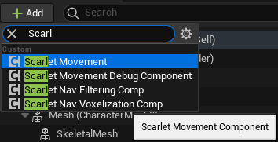

*NOTE: Alternatively you can use classes that are derived from Scarlet Movement, for example `ZarisMovement`. Such classes can have In-Editor parameter configuration.*

*2.* Setup movement stack (might be preconfigured in derived classes):

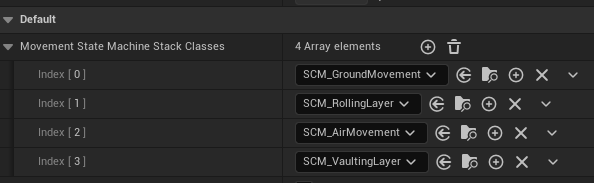

*NOTE: First element of the `MovementStateMachineStackClasses` is the lowest layer, last element - top layer.*

*3.* Configure Scarlet Movement to your liking (*See "Configuration"*);

*4.* Setup Input (See "Input").

---
### Configuration

Generally, to change parameters you can address them directly by name:

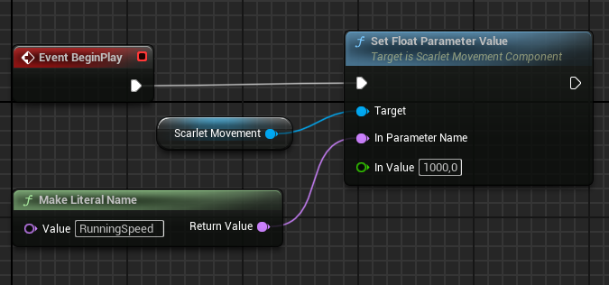

To get parameter's current value you can use `Get<Type>ParameterValue` function. Such functions are unique for each parameter type (`bool`, `int32`, `float`):

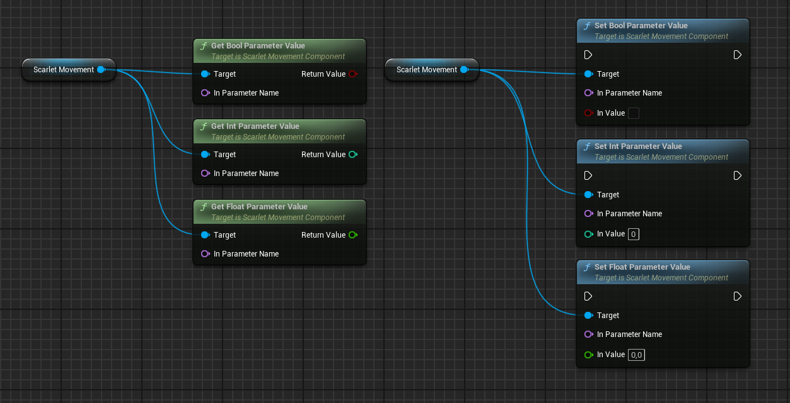

*NOTE: Passing incorrect parameter names will lead to registration of new parameters, that will not be used as expected. Be careful with parameter names to avoid frustrating debugging sessions. To see all available parameters refer to documentation (for `ZarisMovement` it is located here: [Zaris-Style Movement](../Default/Zaris-Style%20Movement.md)) or use `GetAllParameterNames` function:*

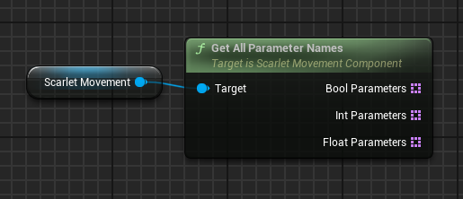

If you are using a derived class (like `ZarisMovement`) you can change default parameter values in component's default configuration:

  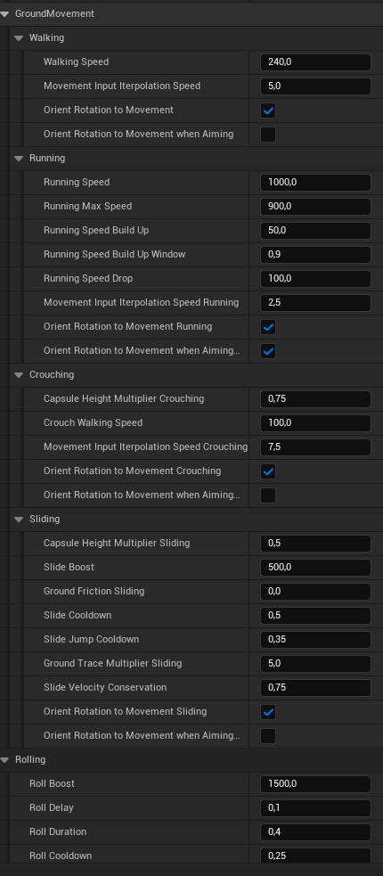

Derived classes usually provide dedicated getters and setters for every parameter:

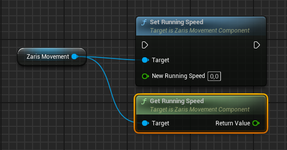

For more technical details see: [Parameters](../Parameters.md)

---
### Input

#### Default Input

To pass Movement Input Vector and current Camera Rotation to the Scarlet Movement you should use `SetMovementInputVector` and `SetCurrentCameraRotation` functions. Camera rotation input is used to calculate movement direction based on the input vector.

*Default input setup example:*

You can configure input processing parameters in `ScarletMovement` component's parameters:

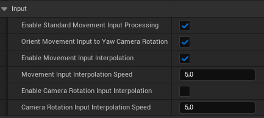

**When to use Movement Input Interpolation?**
* For Third-Person games it is recommended to ENABLE Movement Input Interpolation;
* For First-Person it is recommended to DISABLE Movement Input Interpolation.

For more information on input processing: [Input](../Input.md)

#### Custom Input

Any input other than Movement Input Vector is handled using custom input. Custom input values have names assigned to them.

To modify custom input values you can directly access them by name:

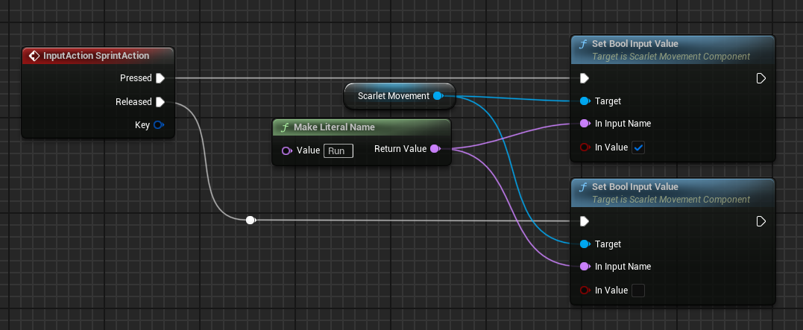

Such functions are unique for each parameter type:
- `bool` : `SetBoolInputValue`, `GetBoolInputValue`;
- `int32` : `SetIntInputValue`, `GetIntInputValue`;
- `float` : `SetFloatInputValue`, `GetFloatInputValue`;
- `FVector` : `SetVectorInputValue`, `GetVectorInputValue`;
- `FRotator` : `SetRotatorInputValue`, `GetRotatorInputValue`.

*NOTE: Passing incorrect input names will lead to registration of new input values, that will not be used as expected. Be careful with input names to avoid frustrating debugging sessions. To see all available input values refer to documentation (for `ZarisMovement` it is located here: [Zaris-Style Movement](../Default/Zaris-Style%20Movement.md)) or use `GetAll<Type>InputNames` functions:*

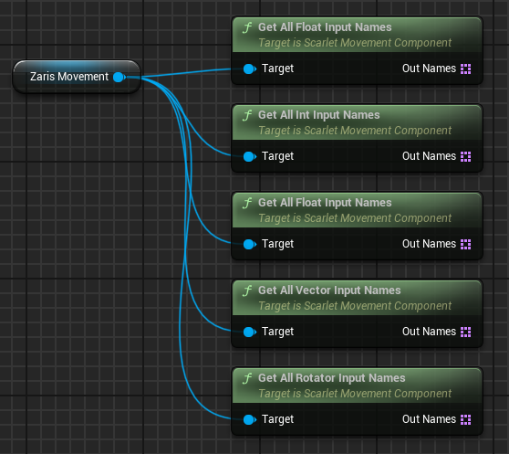

If you are using a derived class you can instead use dedicated functions:

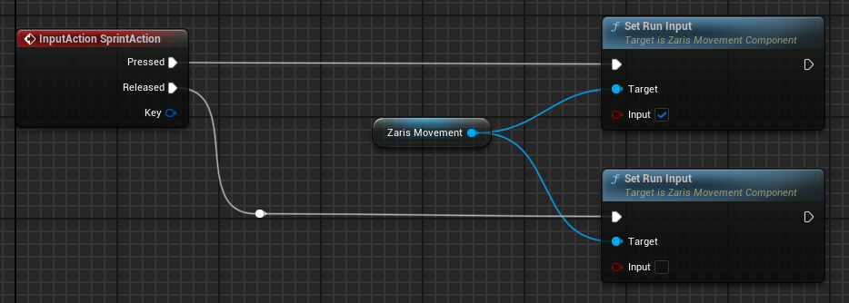

For more technical details see: [Input](../Input.md)

### Debugging

To make debugging of different values easier you can use a `ScarletMovementDebugComponent`:

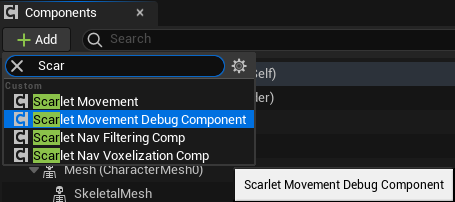

Configure it to display values you are interested in:

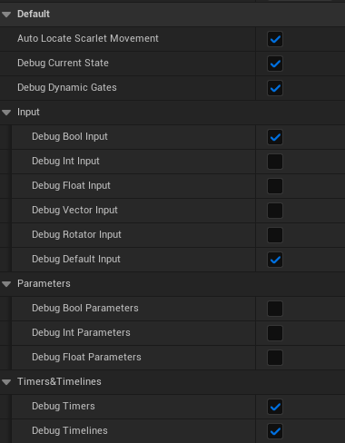

Selected debug values will be printed on screen:

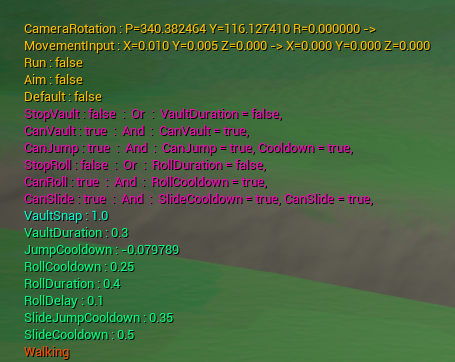