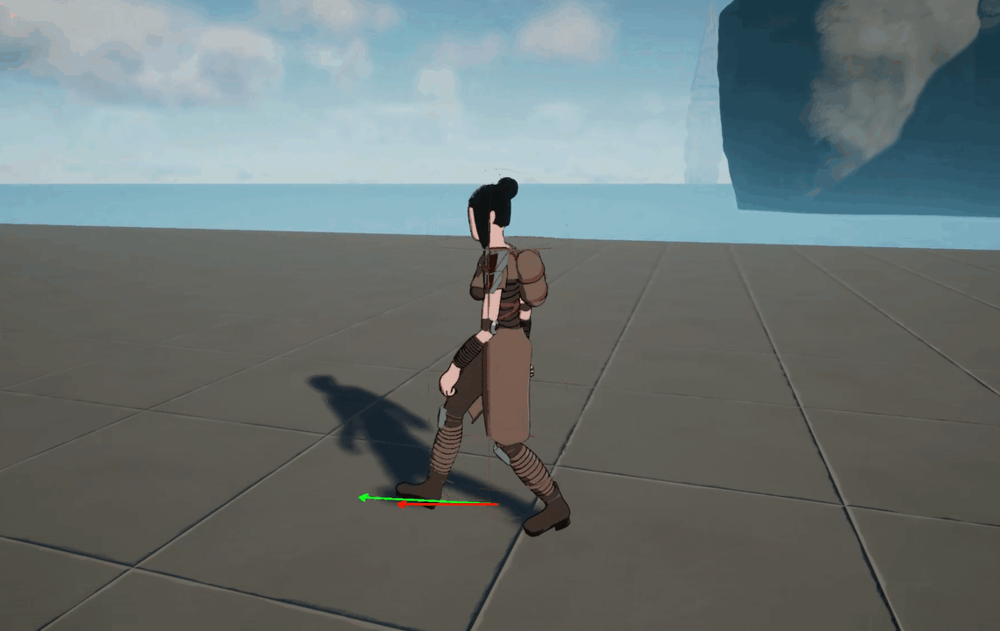
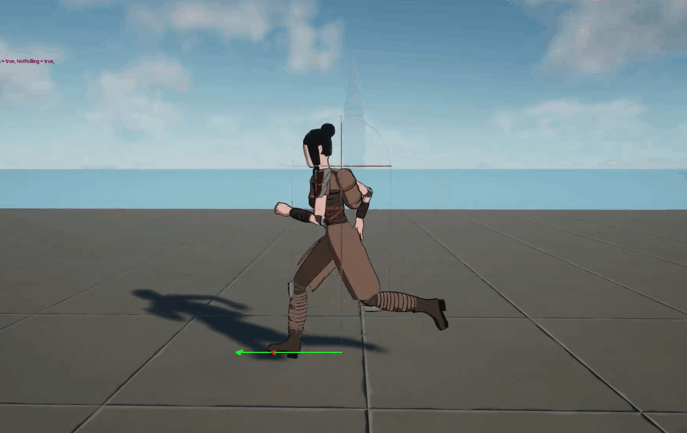
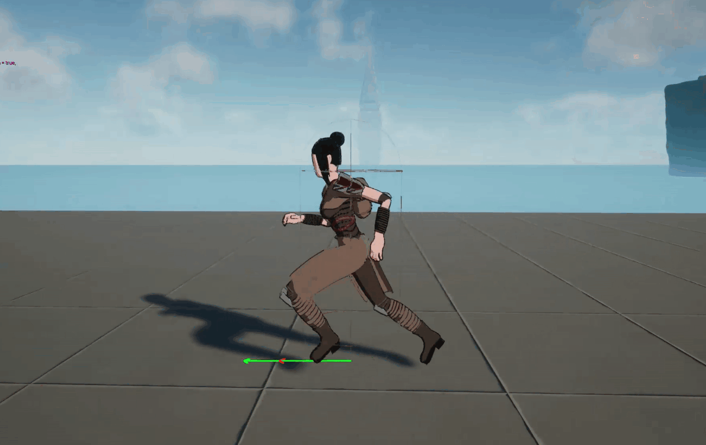
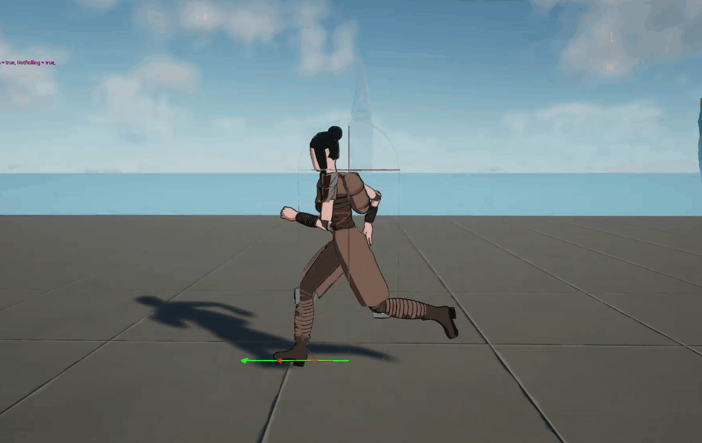
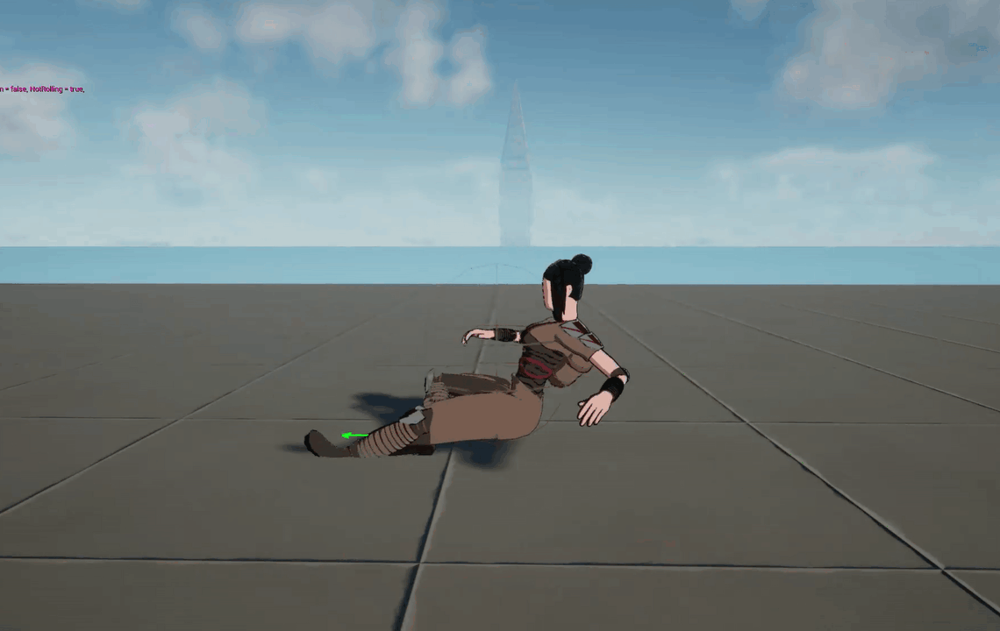
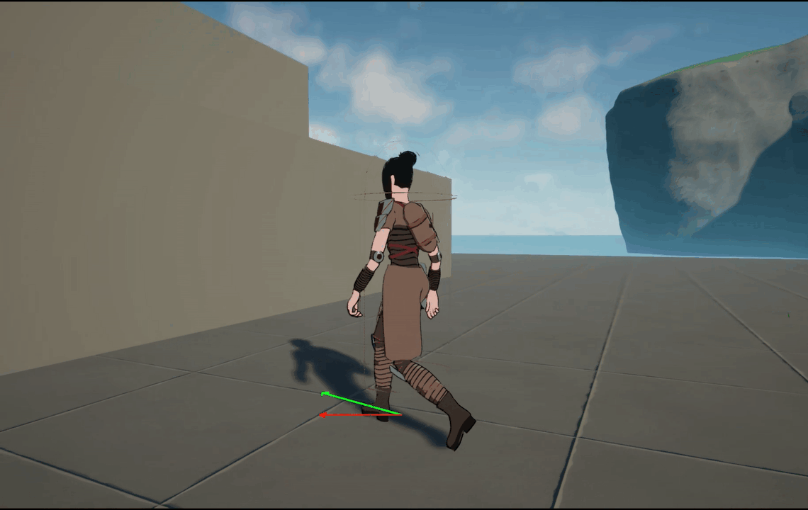

# Scarlet Character Movement

A modular state-machine based character movement system. State machines are used  to control parameters of the default Unreal Engine's Character Movement Component.

**Status: Early Access / In Development**

---
### Features

*NOTE: Animations and character model are not included with the plugin!*
#### Basic ground movement

#### Movement Input Interpolation

#### Running

#### Jumping

#### Sliding

#### Rolling

#### Chaining Movement Features

#### Vaulting

#### Planned Features

* Swimming & Diving;
* Multiplayer support (currently only single-player).

---
### Documentation

*Some parts of the documentation are still "Work In Progress".*

**User Guide:**
* [Usage](Documentation/Guides/Usage.md)
* [Expansion](Documentation/Guides/Expansion.md)

**General:**
* [Design Philosophy](Documentation/Design%20Philosophy.md)
* [Layered State Machine Architecture](Documentation/Layered%20State%20Machine%20Architecture.md)
* [Input](Documentation/Input.md)
* [Parameters](Documentation/Parameters.md)
* [Dynamic Gates](Documentation/Dynamic%20Gates.md)

 **Classes**:
*  [Scarlet Character Movement](Documentation/Classes/Scarlet%20Character%20Movement.md)
* [SCM Movement State Machine](Documentation/Classes/SCM%20Movement%20State%20Machine.md)
* [SCM Movement State Base](Documentation/Classes/SCM%20Movement%20State%20Base.md)
* [Scarlet Movement Function Library](Documentation/Classes/Scarlet%20Movement%20Function%20Library.md)

**Default Movement:**
* [Zaris-Style Movement](Documentation/Default/Zaris-Style%20Movement.md)

### Dependencies
* Scarlet State Machines plugin: [https://github.com/Akarfire/Scarlet-StateMachines](https://github.com/Akarfire/Scarlet-StateMachines)
* Scarlet Timers & Timelines: [https://github.com/Akarfire/Scarlet_TimersAndTimelines](https://github.com/Akarfire/Scarlet_TimersAndTimelines)